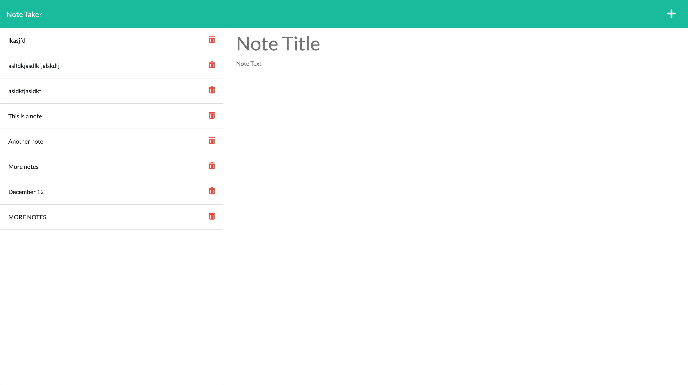

# Note Taker App
  
  

  ## Description

  This is a note app that can be used to write and save notes. This app uses an Express.js back end and saves/retrieves note data from a JSON file. In a world with ever increasing demands, it's extremely necessary to jot down your ideas in an accessible place.

  

  ### Table of Contents

  * [Installation](#installation)
  * [Usage](#usage)
  * [Contribution Guidelines](#contribution-guidelines)
  * [Tests](#tests)
  * [Questions](#questions)
  

  ## Installation

  Download this repo or visit this app's heroku [page](https://shrouded-retreat-08301.herokuapp.com/notes):

  ## Usage

  Type a note title and contents then click the save button. Note saves to server json file. Click delete button next to note to delete.

  ## Contribution Guidelines

  Submit bug or feature requests.

  ## Questions

  If you have any questions, you may contact me at: 

  * Github: https://github.com/anguswaffle
  * Email: aidan.bachtell@gmail.com

  ---

  ## License 

  Licensed under [MIT License](https://opensource.org/licenses/MIT). 

  ---

  ## Tests

  No tests
  